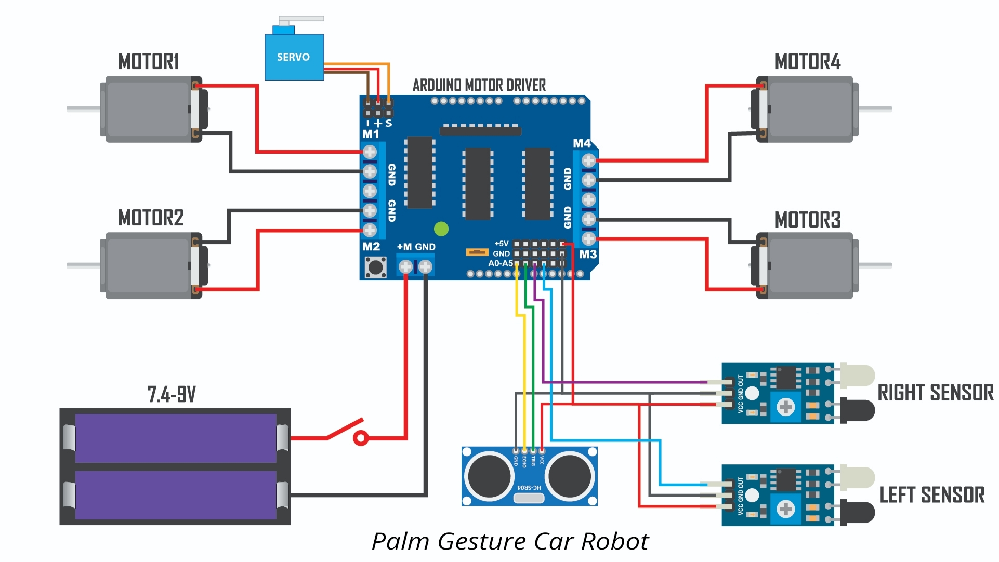

# 🚗 Palm Gesture Controlled Robot Car (Hand Following Robot)

## 📌 Overview

This project is a **gesture-free hand-following robot car** that moves based on the position of a user's hand. Unlike traditional gesture systems, it does not require any wearable device or controller.

The robot uses a combination of ultrasonic and IR sensors to detect hand position and direction in real-time.

---

## 🎯 Key Concept

* No gloves ❌
* No remote ❌
* No accelerometer ❌

✔️ Pure **sensor-based human interaction**

---

## 🧠 Working Principle

* The **ultrasonic sensor** detects the presence of a hand in front.
* Two **IR sensors** detect directional input:

  * Left IR → Turn Left
  * Right IR → Turn Right
* If no hand is detected → the car stops.

---

## ⚙️ Control Logic

* Hand in front → Move Forward
* Hand on left → Turn Left
* Hand on right → Turn Right
* No hand → Stop

---

## 🧰 Components Used

### 🔌 Electronics

* Arduino Uno R3
* L298N Motor Driver Shield
* Ultrasonic Sensor (HC-SR04)
* IR Sensors (2x)
* Servo Motor (SG90)

### ⚙️ Mechanical

* Robot Car Chassis
* DC Gear Motors (4x)
* Wheels & Mounts

### 🔋 Power

* 2x 18650 Battery Pack

---

## 🔌 Circuit Diagram

---

## 💻 Code

The complete Arduino code is available in the repository.

---

## 🚀 Features

* Real-time hand tracking
* No wearable device required
* Simple and intuitive control
* Low-cost implementation
* Fast response system

---

### 🎥 Demo Video (Click on the thumbnail below 👇)

---

## 🧠 Technical Highlight

The system prioritizes directional control using IR sensors over forward motion, ensuring precise hand-following behavior.

---

## 🔮 Future Improvements

* AI-based gesture recognition
* Camera integration
* Speed control using PWM
* Mobile app connectivity

---

## 👨‍💻 Author

**Krish Macwan**
