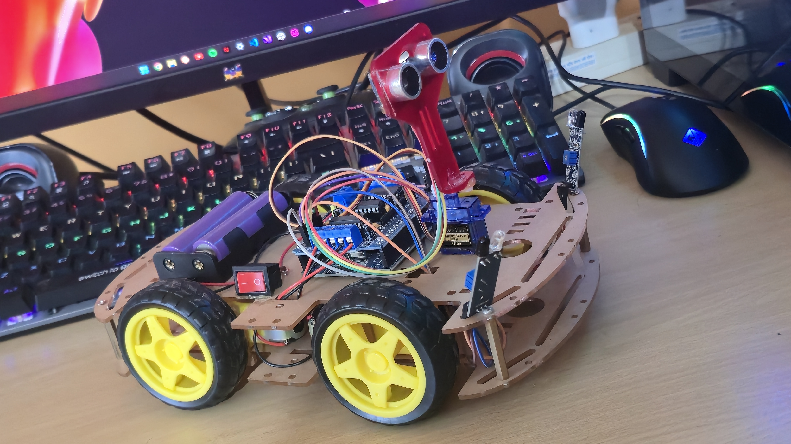
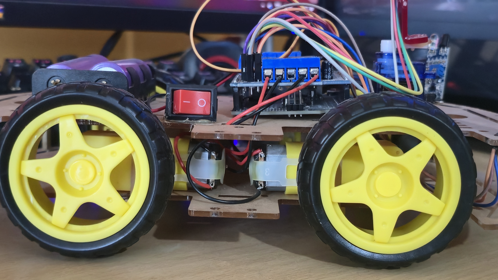

# 🚗 Palm Gesture Controlled Robot Car (Hand Following Robot)

---

## 📌 Overview

This project demonstrates **gesture-free human-machine interaction** using sensor-based hand tracking.

It is a hand-following robot car built using Arduino that moves according to the position of a user’s hand — without requiring any wearable device or remote control.

---

## 🎯 Key Concept

* No gloves ❌
* No remote ❌
* No accelerometer ❌

✔️ Pure sensor-based control

---

## 🧠 Working Principle

* The **ultrasonic sensor** detects the presence of a hand in front.
* Two **IR sensors** detect direction:

  * Left IR → Turn Left
  * Right IR → Turn Right
* If no hand is detected → the car stops

---

## ⚙️ Control Logic

* Hand in front → Move Forward
* Hand on left → Turn Left
* Hand on right → Turn Right
* No hand → Stop

---

## 🧰 Components Used

### 🔌 Electronics

* Arduino Uno R3
* L298N Motor Driver Shield
* Ultrasonic Sensor (HC-SR04)
* IR Sensors (2x)
* Servo Motor (SG90)

### ⚙️ Mechanical

* Robot Car Chassis
* DC Gear Motors (4x)
* Wheels & Motor Mounts

### 🔋 Power

* 2x 18650 Battery Pack

---

## 🔌 Circuit Diagram

---

## 🖼️ Demo Images

---

## 💻 Code

Arduino code is available in the `code/` directory.

---

## 🚀 Features

* Real-time hand tracking
* No wearable device required
* Simple and intuitive control
* Low-cost implementation
* Fast response system

---

## 🧠 Technical Highlight

The system prioritizes directional control using IR sensors over forward motion, ensuring accurate hand-following behavior.

---

## 🔮 Future Improvements

* AI-based gesture recognition
* Camera integration
* Speed control using PWM
* Mobile app connectivity

---

## 👨‍💻 Author

**Krish Macwan**
